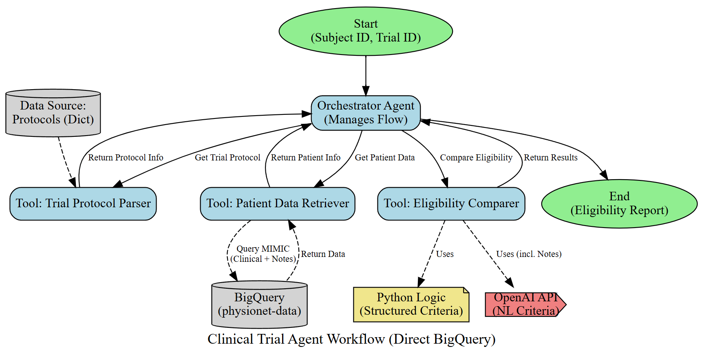
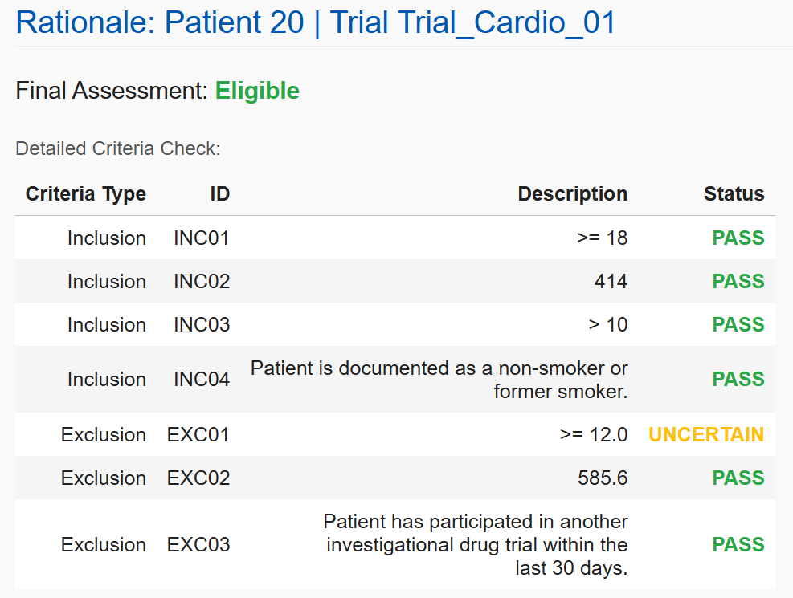
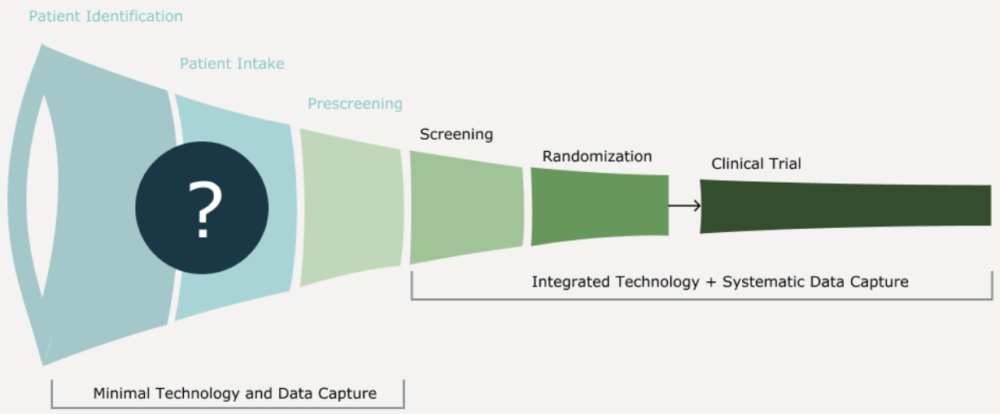
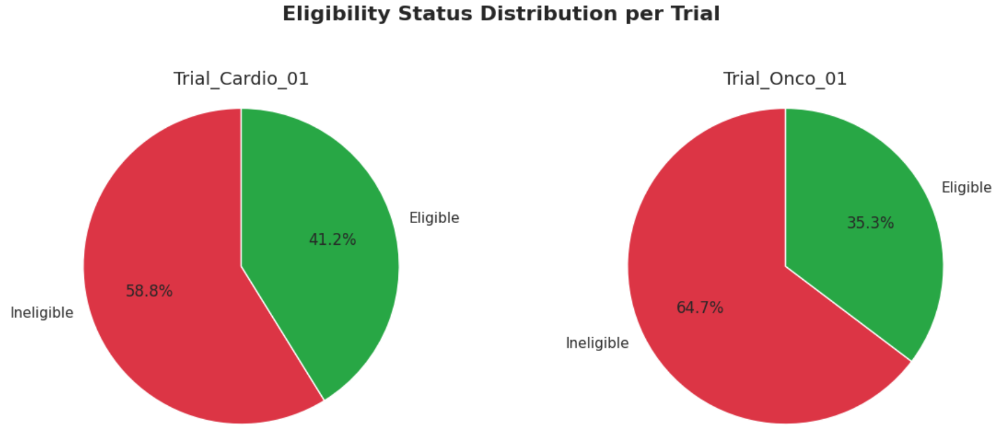
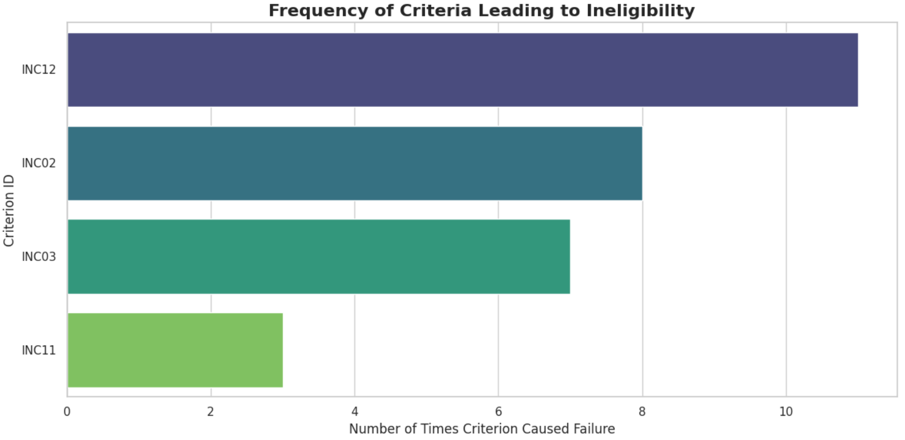
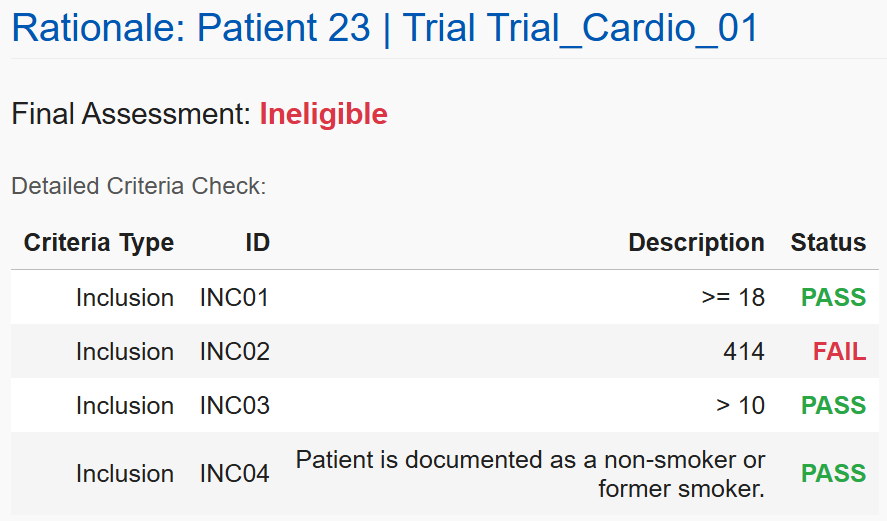
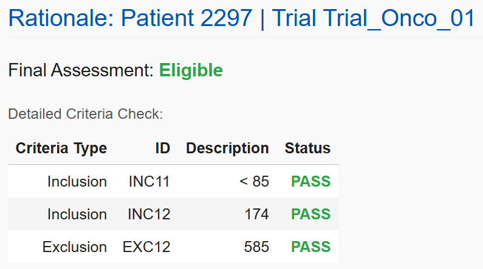
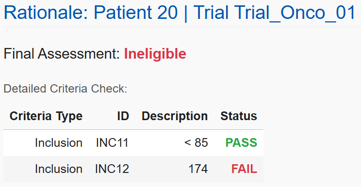

# 🏥 Clinical Trial Recruitment Automation

An agent-based system for automating clinical trial pre-screening using Electronic Health Records (EHR) and Large Language Models (LLMs). Built with Python, BigQuery, OpenAI GPT-4o, and the MIMIC-III clinical database.

  
   
  <em>Agent-Based System Workflow Architecture</em>

## 🌟 Overview

Clinical trial recruitment is a critical bottleneck in medical research, with patient screening being particularly time-consuming and resource-intensive. This project demonstrates an agent-based approach to automate the pre-screening process, combining structured data analysis with LLM-powered natural language processing.

  
   
  <em>Transparent Eligibility Assessment with Criterion-Level Explainability</em>

Our system delivers:

- **Complete transparency**: Every eligibility decision includes detailed criterion-by-criterion rationales
- **Hybrid intelligence**: Combines rule-based logic with LLM capabilities for comprehensive assessment
- **Clinical trust**: Physicians can verify exactly why patients are deemed eligible or ineligible
- **Efficient screening**: Automatically retrieves and processes patient data from electronic health records
- **Unparalleled explainability**: No "black box" decisions—each result shows the exact reasoning path

By automating this labor-intensive process while maintaining full transparency, our system has the potential to significantly accelerate trial recruitment while enhancing clinical confidence in the screening results.

## 🔍 The Challenge

  

Clinical trial recruitment faces significant challenges:

- Manual screening of EHRs is labor-intensive and error-prone
- Complex eligibility criteria spanning structured and unstructured data
- Critical information often buried in clinical notes
- Heterogeneous data formats across clinical systems
- High costs and delays associated with recruitment failures

## 🛠️ System Architecture

Our agent-based system comprises specialized components working together:

<table>
<tr>
<th colspan="3">System Components</th>
</tr>
<tr>
<td width="30%" valign="top">

### 🤖 Orchestrator Agent
- Manages end-to-end workflow
- Coordinates specialized tools
- Aggregates final results
- Provides unified interface

</td>
<td width="70%" colspan="2">

### 🔎 Specialized Tools

<table>
<tr>
<td width="33%" valign="top">

#### 1. Patient Data Retriever
- Queries MIMIC-III via BigQuery
- Retrieves demographics, diagnoses, medications, labs, and notes
- Processes heterogeneous data

</td>
<td width="33%" valign="top">

#### 2. Protocol Parser
- Interprets trial protocols
- Extracts inclusion/exclusion criteria
- Categorizes by criterion type

</td>
<td width="33%" valign="top">

#### 3. Eligibility Comparer
- Evaluates each criterion
- Handles structured & NL criteria
- Uses LLM for unstructured data
- Manages uncertainty

</td>
</tr>
</table>

</td>
</tr>
</table>

## 📊 Key Features

- **Hybrid Evaluation Approach**: Combines deterministic rule-based processing for structured data with LLM-based analysis for unstructured text
- **Uncertainty Handling**: Configurable permissive/strict logic for managing uncertain assessments
- **Detailed Explanations**: Complete breakdown of how each criterion was assessed
- **Visualization Tools**: Multiple visualizations of eligibility outcomes and failure patterns
- **MIMIC-III Integration**: Direct querying of a realistic clinical database

## 📈 Results & Analysis

Our prototype demonstrates the feasibility of an agent-based approach to clinical trial pre-screening while highlighting important challenges in the domain.

  
   
  <em>Eligibility Distribution Across Trial Types</em>

  
   
  <em>Frequency of Criteria Leading to Ineligibility</em>

### AI Explainability

A key strength of our system is its ability to provide detailed, transparent rationales for every eligibility decision. This explainability is critical for clinical applications where understanding the "why" behind recommendations is as important as the recommendations themselves.

For each patient, the system generates a comprehensive breakdown showing:
- The final eligibility assessment
- Each criterion that was evaluated
- Whether the patient passed or failed each specific criterion
- The exact reason for each decision

<table>
<tr>
<td width="50%" valign="top">

  
   
  <em>Patient 20: Eligible for CardioHealth Trial</em>

</td>
<td width="50%" valign="top">

  
   
  <em>Patient 23: Ineligible for CardioHealth Trial</em>

</td>
</tr>
<tr>
<td width="50%" valign="top">

  
   
  <em>Patient 2297: Eligible for Oncology Trial</em>

</td>
<td width="50%" valign="top">

  
   
  <em>Patient 20: Ineligible for Oncology Trial</em>

</td>
</tr>
</table>

These detailed rationales provide several benefits:

- **Clinical Trust**: Physicians and clinical trial coordinators can verify the accuracy of screening decisions
- **Process Transparency**: The decision path is fully visible, not a "black box" algorithm
- **Error Detection**: Inconsistencies or data quality issues become immediately apparent
- **Educational Value**: The system demonstrates how specific criteria impact eligibility
- **Audit Trail**: Decisions can be reviewed and validated during regulatory inspection

The system effectively processes both structured criteria (age, lab values, diagnosis codes) and makes reasonable assessments of natural language criteria when sufficient information is available in clinical notes. By clearly labeling uncertain determinations, the system acknowledges its limitations and identifies cases requiring human review.

This approach to explainable AI is essential for clinical applications where automated systems must augment rather than replace human decision-making, ensuring that technology enhances rather than obscures the recruitment process.
## 🧠 LLM Integration

The system leverages OpenAI's GPT-4o to:

- Interpret natural language eligibility criteria
- Extract relevant information from clinical notes
- Make reasoned judgments based on available evidence
- Indicate uncertainty when information is insufficient

Example natural language criteria:
- "Patient is documented as a non-smoker or former smoker"
- "Patient has participated in another investigational drug trial within the last 30 days"

## 🔬 Sample Trials

The system was tested with simplified protocols:

<table>
<tr>
<td width="50%" valign="top">

### CardioHealth Study
A cardiovascular trial with inclusion criteria for:
- Age ≥ 18
- Coronary artery disease (ICD-9: 414)
- eGFR > 10
- Non-smoking status

**Exclusion Criteria:**
- Hemoglobin A1c ≥ 12.0
- End-stage renal disease (ICD-9: 585.6)
- Recent participation in other trials

</td>
<td width="50%" valign="top">

### Breast Cancer Adjuvant Therapy Trial
An oncology trial targeting:
- Age < 85
- Breast cancer diagnosis (ICD-9: 174)
- Without severe kidney disease

**Key Considerations:**
- Primary focus on early-stage disease
- Evaluates novel adjuvant therapy
- Excludes patients with renal complications

</td>
</tr>
</table>

## 🔮 Future Directions

- **Protocol Parsing**: Develop robust PDF parsing for real-world protocol documents
- **Advanced NLP**: Implement specialized NLP pipelines for entity extraction from clinical notes
- **Longitudinal Analysis**: Incorporate time-series data analysis for comprehensive patient assessment
- **Uncertainty Quantification**: Develop more sophisticated methods for managing and communicating uncertainty
- **Domain-Specific LLMs**: Train or fine-tune models specifically for clinical trial criteria evaluation
- **Knowledge Graph Integration**: Represent medical knowledge and patient data as graphs for enhanced reasoning

## 📜 License

This project is licensed under the MIT License - see the [LICENSE](LICENSE) file for details.

### MIMIC-III Database

This project uses data from the MIMIC-III database:

- MIMIC-III, a freely accessible critical care database. Johnson AEW, Pollard TJ, Shen L, Lehman L, Feng M, Ghassemi M, Moody B, Szolovits P, Celi LA, and Mark RG. Scientific Data (2016). DOI: 10.1038/sdata.2016.35.

The use of the MIMIC-III database is governed by a data use agreement which requires:
1. Training in human research subject protection (e.g., CITI certification)
2. Agreement to the PhysioNet Credentialed Health Data License
3. Proper citation of the data source in any publication or research

For detailed information on obtaining access to MIMIC-III, please visit: [https://mimic.mit.edu/](https://mimic.mit.edu/)

## 🙏 Acknowledgments

- MIMIC-III database and PhysioNet for providing clinical data
- Google Cloud BigQuery for powerful data processing
- OpenAI for GPT-4o access

---

Made with ❤️ by Karthik Sivakoti for improving clinical trial recruitment and accelerating medical research.
